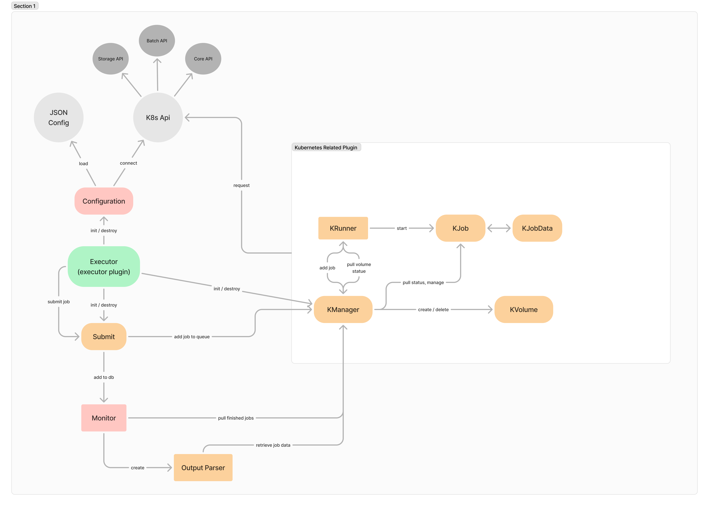

# GASW-Kubernetes-Plugin
## Kubernetes !?
> [!NOTE]
> If you never used Kubernetes or have bad knownledges about you should take a look as those links !

- [Basis](https://kubernetes.io/fr/docs/tutorials/kubernetes-basics/)
- [Components](https://kubernetes.io/docs/concepts/overview/components/)
- [Pods](https://kubernetes.io/fr/docs/concepts/workloads/pods/pod/)
- [Jobs](https://kubernetes.io/docs/concepts/workloads/controllers/job/)
- [Persistent Volumes](https://kubernetes.io/docs/concepts/storage/persistent-volumes/)

## Plugin
### Description
This plugin is used in the case of [Virtual-Imaging-Platform](https://www.creatis.insa-lyon.fr/vip/) project.  
It is called from the *engine motor* and then utilised in completition of [GASW](https://github.com/virtual-imaging-platform/GASW).  

### Prerequisite
To run this plugin you need to use at least **Java 21** runtime environnement cause of the **Kubernetes Dependency**.  
You should also provide **config.json** file witch contain the information about the plugin it self (the location shall be */var/www/cgi-bin/kubernetes/config.json*).  

### Job lifecycle
When a job is requested for the *moteur engine*, there is few steps before the job is **submitted** to kubernetes :  
+ check if the manager is inited
+ check if the workflow volume is ready

### Job Statuses
Something important is the status of a job.
In the code there is *two statuses* (but represented by one variable):  
+ **the local status** : this status isn't stored in the database and just use inside the code to check some completions steps.  
+ **the dao status** : this status is when we choose to make visible to the client the local status.  

For example when the job is ready to be submitted we don't change the status for the client, for him it just in queued.  
So, you just have to understand that sometimes the **KJobData.status** variable is *synchronized* with the *dao* and sometimes not.  

### Configuration File
There is an example configuration file provided in the repository and it should be located in **/var/www/cgi-bin/m2Server-gasw3/conf/kubernetes_plugin.conf**  

## Code
### Structure
I've made a figma scheme the represent briefly the *code structure* of the plugin. 

### Upgrades and Modification
If you want to make some changes there is the class **KConstants** that contain some hardcoded values (like the config file path).  
There is also the possibility to change to a *remoteClient* instead of *configClient* (see in **KConfiguration**).  

If you want to make the plugin support multi-container per pods, it should be possible but you need to make some change around the *statuses* and the *container builder* (configure function).

### Debug
> [!NOTE]
> Have a look at [Kubectl](https://kubernetes.io/docs/reference/kubectl/)

> [!TIP]
> By default kubectl use the **default** namespace, if you configured a different one. Please use the flag *-n* [namespace] or *--all-namespaces*

You may need to *debug* your code or your **Kubernetes cluster** sometimes. Here is a few commands that might help you :  
+ `kubectl get [pods/jobs/nodes]` : list all the [pods/jobs/nodes]
+ `kubectl exec -it [pod-ID] -- bash` : spawn a bash terminal inside the pod container  
+ `kubectl get [pv/pvc]` : list all the persistent volume and persistent volume claim of the cluster  
+ `kubectl describe [pods/jobs/pv/pvc/nodes]` : describe all the [pods/jobs/pv/pvc/nodes]
+ `kubectl describe [pod/job/pv/pvc/node] [value-ID]` : describe a specific [pod/job/pv/pvc/node]

### Known issues
> [!IMPORTANT]
> Those issues might have been solved by some kubernetes-api updates, but we recommand to have a look !

If your cluster **crashes or is unavailable** during a workflow execution (and exceed the retries values of KConstants), you might have a **lost pvc and pv**.  
The pv and pvc **won't be deleted automaticly** and should do it manually.  